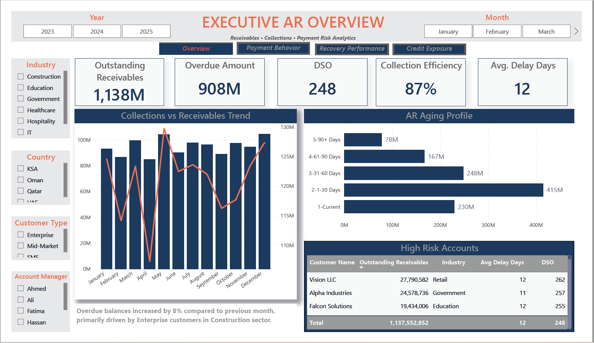
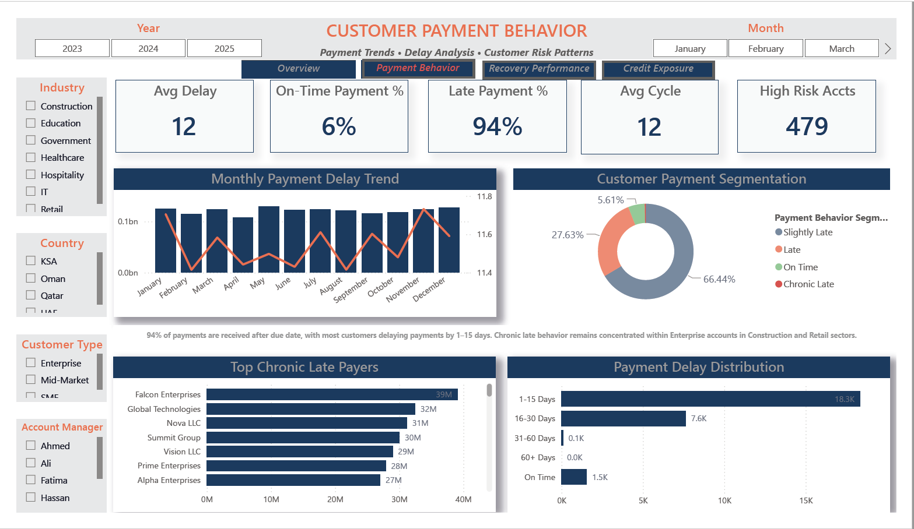
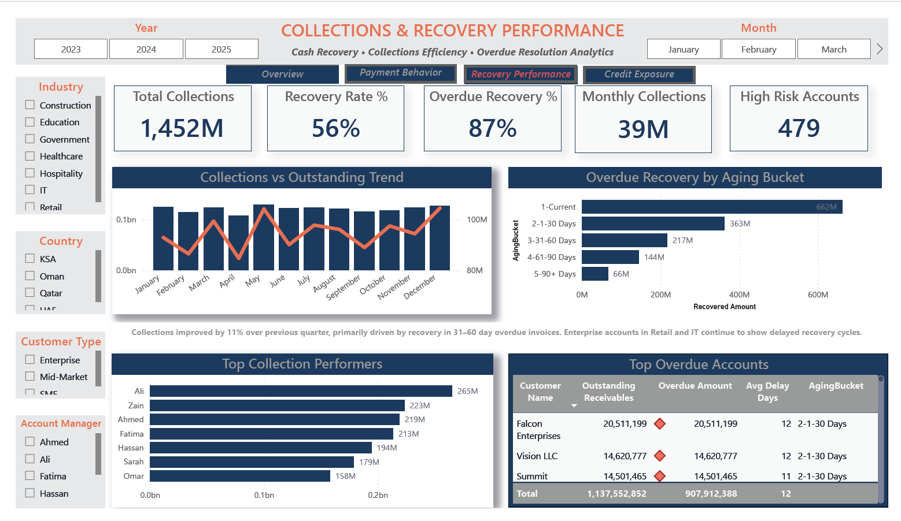
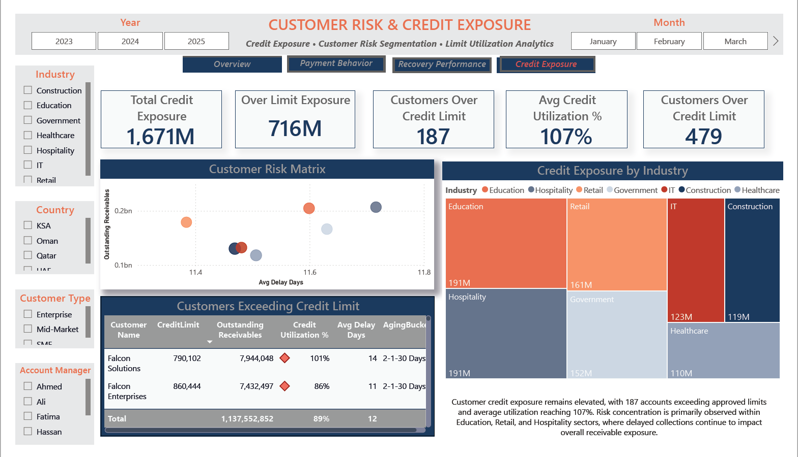

# Accounts Receivable Analytics Dashboard

## Overview

This project is an executive-level Accounts Receivable analytics solution developed in Power BI to provide centralized visibility into receivables performance, customer payment behavior, collection efficiency, and working capital management.

The dashboard transforms fragmented receivables and customer payment data into actionable financial intelligence that supports faster collection cycles, improved cash flow visibility, and stronger credit risk monitoring.

The objective of this project was to build a finance-focused business intelligence solution that enables leadership teams to monitor receivable trends, overdue balances, aging structures, and customer collection risks through interactive and executive-friendly reporting.

---

# Business Problem

Organizations often face challenges such as:

- delayed customer collections
- lack of visibility into overdue receivables
- inefficient collection tracking
- increasing working capital pressure
- difficulty identifying high-risk customers
- fragmented reporting across finance teams
- limited insights into collection trends and aging buckets

This dashboard was developed to solve these challenges through centralized and interactive financial analytics.

---

# Project Objectives

The dashboard was designed to help management:

- monitor outstanding receivables
- track overdue customer balances
- analyze aging bucket distribution
- improve collection efficiency
- identify high-risk customer accounts
- monitor working capital exposure
- support faster financial decision-making
- improve receivables visibility across business units

---

# Tools & Technologies Used

- Power BI
- Power Query
- DAX Measures
- Microsoft Excel
- Data Modeling
- Financial Analytics
- KPI Reporting
- Aging Analysis
- Interactive Dashboard Filters
- Working Capital Analytics
- Executive Reporting

---

# Data Source

### Source Type:
Microsoft Excel

### Data Includes:

- Customer Receivables Data
- Invoice-Level Transactions
- Payment Information
- Aging Bucket Details
- Collection Status
- Overdue Analysis
- Customer Outstanding Balances
- Payment Trends
- Collection Team Performance

---

# Dashboard Modules

## Executive Overview Dashboard

Provides a high-level summary of:

- Total receivables
- Outstanding balances
- Overdue amount tracking
- Collection performance
- Aging distribution
- Working capital visibility
- Collection trend analysis
- Customer payment behavior

---

## Aging Analysis Dashboard

Focused on:

- Aging bucket analysis
- Current vs overdue receivables
- 30/60/90/120+ overdue tracking
- Customer aging segmentation
- High-risk overdue accounts
- Overdue trend monitoring

---

## Collections Performance Dashboard

Focused on:

- Collection efficiency tracking
- Collection recovery trends
- Payment collection performance
- Collector/team performance
- Monthly collection analysis
- Recovery percentage tracking

---

## Customer Risk Dashboard

Focused on:

- High-risk customer identification
- Outstanding exposure analysis
- Payment delay behavior
- Customer overdue concentration
- Credit risk visibility
- Customer payment trends

---

# Key KPIs Tracked

- Total Accounts Receivable
- Total Outstanding Balance
- Total Overdue Amount
- Collection Rate %
- Recovery Rate %
- Average Collection Days
- Aging Bucket Distribution
- Current vs Overdue Receivables
- High-Risk Customer Exposure
- Customer Outstanding Trend
- Collection Efficiency %
- Working Capital Exposure

---

# Key Insights Generated

- Identified high-risk overdue customer segments
- Improved visibility into collection efficiency trends
- Highlighted customers contributing to working capital pressure
- Enabled management to monitor overdue aging buckets
- Tracked collection performance against receivable targets
- Provided executive-level visibility into receivables health
- Improved financial decision-making through centralized reporting

---

# Repository Structure

```text
accounts-receivable-analytics/
│
├── README.md
├── accounts-receivable-analytics-dashboard.pbix
├── accounts-receivable-data.xlsx
│
├── screenshots/
│   ├── executive-overview-dashboard.png
│   ├── aging-analysis-dashboard.png
│   ├── collections-performance-dashboard.png
│   └── customer-risk-dashboard.png
```

---

# Dashboard Preview

## Executive Overview Dashboard


---

## Aging Analysis Dashboard


---

## Collections Performance Dashboard


---

## Customer Risk Dashboard


---

# Business Value Delivered

This dashboard helps finance leadership teams:

- improve receivable visibility
- strengthen collection processes
- reduce overdue balances
- improve working capital monitoring
- identify risky customer payment patterns
- support proactive financial management
- enable faster executive decision-making

---

# About This Project

This project is part of my growing analytics portfolio focused on:

- Executive Business Intelligence
- Financial Analytics
- KPI & Performance Reporting
- Working Capital Analytics
- Finance Transformation
- Business Performance Intelligence

Through Boardroom Insights, I aim to combine finance, strategy, and analytics into solutions that help businesses create clarity, visibility, and smarter decision-making.

---
